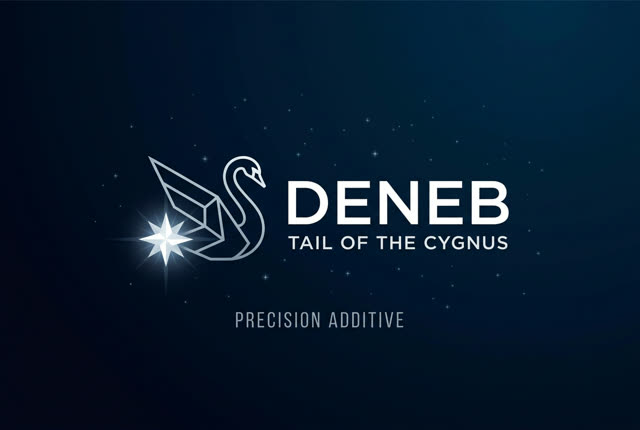

<p align="center">
  
</p>

# Deneb

Deneb transforms the UltiMaker 2+ Connect with a rebuilt native touchscreen,
enhanced swipe and drag interaction, local-network printing that the stock
firmware did not provide, and a basic browser Web UI. Local Cura/Web/API jobs
and Digital Factory cloud jobs converge on the same native print backend while
preserving hardware safety and a path back to official firmware.

Deneb is rewriting the firmware's Python application layer in C so Python can
be removed from the final image entirely. The completed C replacements have
reduced the measured idle Python-service footprint by 76.4%, from 113.2 MB to
26.7 MB VSZ. All seven coordinator-replacement workstreams are covered: three
are closed and four need final target proof or fixes. The documented remaining
work is those hardware gates, a Python-free bootstrap/rollback path, and a
replacement for the Python AVR programming and recovery tooling.

> Experimental: not yet a stable replacement firmware or independent image.

## Name

The stock firmware/application layer appears to use the codename `Cygnus`.
Cygnus is both a mythological swan and a northern constellation, which fits a
cloud-first printer identity. Deneb is the brightest star in Cygnus. The name
keeps a respectful relationship to that lineage while making clear this is a
separate community mod, not official UltiMaker firmware.

## Current Status

| Area | Status | Key gap |
| --- | --- | --- |
| Touchscreen | **Experimental** | Native LVGL UI adds vertical swipe scrolling and horizontal drag sliders; Pause safety, material, leveling Cancel, update UX, and diagnostics remain open. |
| Print service | **Experimental** | One native backend executes USB, local-network Cura/Web/API, and Digital Factory jobs; Pause/Resume and long-soak stability are not release-ready. |
| Web/API/Cura | **MVP** | Adds the stock-missing local-network discovery, upload, monitoring, control, and basic Web UI; connection cleanup, storage UX, security, and failure recovery need work. |
| Python elimination | **In progress** | 76.4% of measured stock Python-service VSZ is removed from the idle stack. All 7 coordinator workstreams have implementation/decision coverage: 3 are closed and 4 await bounded target proof or fixes for material, leveling Cancel, Pause/Resume, diagnostics, and recovery. Native rollback/bootstrap and AVR recovery also remain. |
| Resource optimization | **In progress** | Retain lighttpd as the HTTP front end and move more generic HTTP work into it where that improves reliability without exceeding resource limits. |
| Independent image and modern Marlin | **Planned** | Current OpenWrt hardware support, safe recovery, and the controller port are not complete. |

See [Project Status](docs/PROJECT_STATUS.md) for the detailed work board and
[Modernization Roadmap](docs/PLATFORM_MODERNIZATION_ROADMAP.md) for phase gates.

## Components

| Component | Role |
| --- | --- |
| `deneb-ui` | Native LVGL touchscreen UI with swipe scrolling and drag sliders |
| `deneb-printsvc` | Native backend for USB, local-network Cura/Web/API, and Digital Factory print jobs |
| `deneb-api` and static Web UI | Local-network REST, upload/control, status, and basic browser interface |
| `deneb-mdns` and Cura plugin | Local-network Cura discovery and UM2+ Connect profile mapping |
| `deneb-dfsvc` | Native Digital Factory cloud connector and remote-job bridge |
| USB network setup | Client-only WiFi and Ethernet configuration |
| `.deneb` update package | Installs and audits the native stack |

Implementation does not imply that every workflow is hardware-proven. The
76.4% figure is a measured idle runtime footprint reduction, not a claim that
76.4% of functional de-Pythonization gates are complete; see the
[baseline measurements](docs/evidence/BASELINE_MEASUREMENTS.md). Likewise, the
coordinator count distinguishes implemented replacement coverage from final
target acceptance. Its per-workstream status is recorded in the
[coordinator completion ledger](docs/archive/COORDINATOR_PARITY_COMPLETION_PLAN.md).

## Documentation

| Need | Document |
| --- | --- |
| Documentation map | [docs/README.md](docs/README.md) |
| Current work, defects, and priorities | [Project Status](docs/PROJECT_STATUS.md) |
| De-Python, Web, OpenWrt, image, and Marlin plan | [Modernization Roadmap](docs/PLATFORM_MODERNIZATION_ROADMAP.md) |
| Windows/WSL cross-build setup | [WSL Build Environment](docs/WSL_BUILD_ENVIRONMENT.md) |
| Web/API and Cura | [Web UI](docs/WEB_UI.md) / [Cura](docs/CURA_INTEGRATION.md) |
| Third-party slicer command/profile rules | [Slicer Compatibility](docs/SLICER_COMPATIBILITY.md) |
| Touchscreen and backend | [UI](ui/README.md) / [IPC](docs/BACKEND_IPC_PROTOCOL.md) |
| Contribution and source provenance | [CONTRIBUTING.md](CONTRIBUTING.md) / [Provenance](docs/SOURCE_PROVENANCE.md) |

Dated investigations are under `docs/evidence/`; superseded plans are under
`docs/archive/`. Neither is a current work queue.

## Build

Target binaries require Debian under WSL 2 and the documented MIPS musl
toolchain. Complete the [WSL setup](docs/WSL_BUILD_ENVIRONMENT.md) first.

```powershell
# Experimental MIPS update package
powershell -ExecutionPolicy Bypass -File tools/build-update-release.ps1

# Touchscreen host-stub build
powershell -ExecutionPolicy Bypass -File tools/build-ui-host.ps1
```

A package is valid only when the release wrapper's audits finish successfully.

## Safety and Repository Boundary

Deneb controls motion, heating, networking, and updates. Treat changes as
hardware-affecting until target-proven, and never expose control endpoints to
untrusted networks.

This repository may contain original Deneb code, documentation, build/install
scripts, and compatibility layers. It must not contain proprietary firmware or
extracted filesystems, decompiled source, private keys, device secrets, or
modified firmware images.

## License

Deneb is an independent community project and is not endorsed by UltiMaker.
Original Deneb files are intended to use MPL-2.0 unless stated otherwise. See
[LICENSE](LICENSE), [COMPLIANCE.md](COMPLIANCE.md), [source provenance](docs/SOURCE_PROVENANCE.md), and
[THIRD_PARTY_NOTICES.md](THIRD_PARTY_NOTICES.md).
