# Touchscreen Screen Catalog

Reference catalog for the current Deneb touchscreen UI. Screenshots are
host-rendered from the LVGL UI at the target 320x240 resolution using the
stub backend, so live device values such as temperatures, network addresses,
USB files, Digital Factory state, and error details are representative rather
than captured from a specific printer session.

Screenshot set last regenerated from commit `caa1490` on 2026-06-13. The
Digital Factory image shows the host-stub default state only; pairing PIN,
connected/reconnecting, cloud error, and authenticated disconnect states still
need target/cloud captures before those workflows are documented as proven.

Regenerate the screenshots from a WSL host build:

```powershell
powershell -ExecutionPolicy Bypass -File tools/build-ui-host.ps1
wsl -- bash -lc "cd /mnt/c/temp/Deneb && rm -rf .tmp-screen-ppm && mkdir .tmp-screen-ppm && ui/build-wsl-host/deneb-ui --lang en --screenshot-dir .tmp-screen-ppm"
```

The screenshot mode writes PPM files. Convert them to PNG before updating the
files in `docs/touchscreen-screens/`.

## Top-Level Flow

Home is the root menu. Most screens show a 32 px title bar and a back button
when entered from the navigation stack. The UI is optimized for short actions
on a 320x240 resistive touchscreen, so several screens use vertical scrolling.

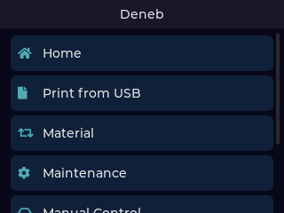

## Screen Catalog

| Screen | Screenshot | Current Role | Primary Actions | Direction Notes |
|---|---|---|---|---|
| Home |  | Root launcher for the major UI areas. | Open Status, Print from USB, Material, Maintenance, Manual Control, Temperature, and Settings. | Keep this as a fast operational hub. The final item can scroll below the viewport, so menu density and discoverability matter. |
| Status | 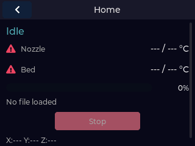 | Live printer overview from the coordinator status stream. | Review printer state, nozzle and bed temperatures, print progress, active file, and X/Y/Z position. | Status and Stop controls now track idle, preheating, printing, and aborted states more closely. Host screenshot uses empty stub telemetry. |
| Print from USB | 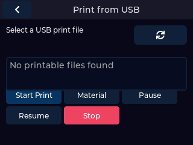 | USB file browser and print job entry point. | Select a G-code file from USB, review readiness, start print, pause/resume, or cancel. | Needs real-device captures for USB-populated, mismatch-continue, preheat, active-print, and aborted states if we want complete workflow docs. |
| Print Conflict | 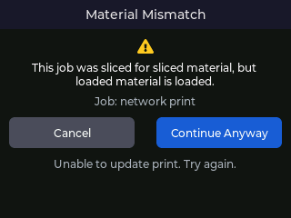 | Conflict/confirmation view for a pending print when the printer state requires user action. | Continue the pending job or cancel it. | Host screenshot proves the screen renders, not the full hardware mismatch/preheat/continue workflow. |
| Material | 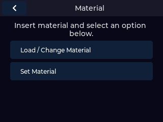 | Material workflow menu. | Load material, unload material, set material, move material, finish movement, and import material profiles. | Good candidate for clearer state gating around busy/printer unavailable conditions. |
| Set Material | 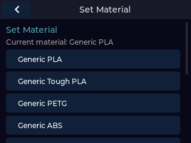 | Material selection screen used from material workflows. | Choose one of the supported material profiles. | Current screen is intentionally simple; future direction may include active material feedback or custom profiles. |
| Maintenance | 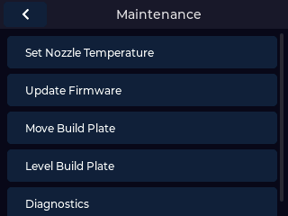 | Maintenance submenu. | Open Temperature, Update Firmware, Move Build Plate, Level Build Plate, and Diagnostics. | This screen is the gateway for hardware-affecting tools, so action labels should stay plain and conservative. |
| Temperature | 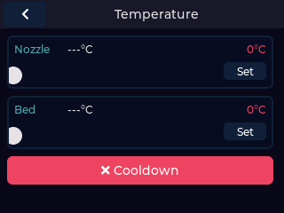 | Nozzle and bed temperature control. | Adjust nozzle and bed target temperatures and start cooldown. | Slider ergonomics are worth revisiting on resistive touch; current design favors compactness. |
| Update Firmware | 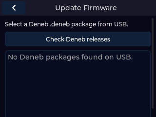 | Deneb-only update package installer. | Select a `.deneb` package from USB and start installation. | The copy should keep distinguishing Deneb packages from stock UltiMaker firmware updates. |
| Manual Control | 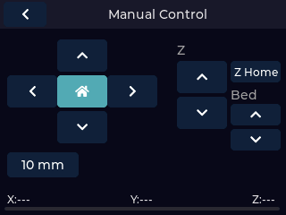 | Motion and build plate controls. | Jog X/Y/Z, home XY, home Z, change jog step, move build plate up/down. | Hardware direction labels are especially important here. Recent changes align the Z controls with build plate motion expectations. |
| Level Build Plate | 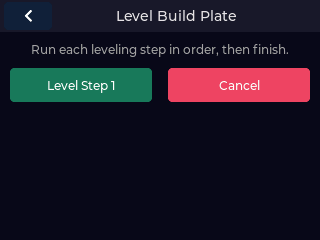 | Build plate leveling macro sequence. | Run leveling steps 1-4 and finish leveling. | This flow may benefit from a wizard-like progression later, but the current screen exposes all stock macro steps directly. |
| Diagnostics | 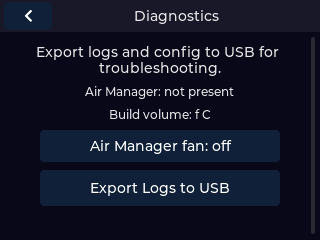 | Device diagnostics and log export. | Review Air Manager/build volume fields and export logs to USB. | Good place to add more actionable hardware/network checks as troubleshooting needs become clearer. |
| Settings | 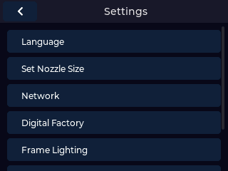 | System configuration submenu. | Open Language, Nozzle Size, Network, Digital Factory, Frame Lighting, Factory Reset, and About Deneb. | This menu is dense; grouping or ordering may become important as settings expand. |
| Language | 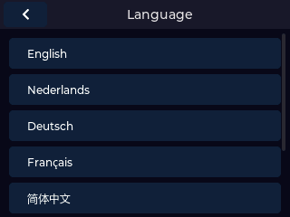 | Runtime language selector. | Switch between English, Dutch, German, French, Simplified Chinese, Pirate English, and L33T English. | Generated font subsets must be refreshed when locale strings add new non-ASCII glyphs. |
| Nozzle Size | 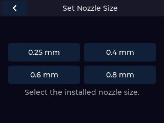 | Installed nozzle size selection. | Choose the configured nozzle diameter. | Future work can connect this more visibly to print compatibility checks. |
| Network | 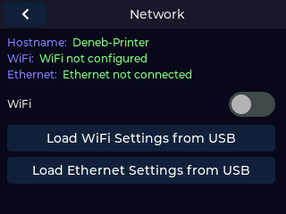 | Network status and USB-based configuration. | Toggle WiFi, import WiFi settings from USB, import Ethernet settings from USB, reset Ethernet to DHCP. | Host screenshot uses deterministic placeholder network values; real-device docs should include WiFi and Ethernet variants. |
| Digital Factory | 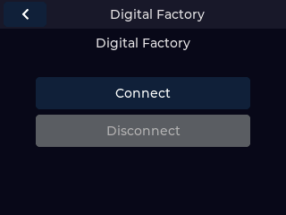 | Digital Factory connection controls backed by `deneb-api digital-factory` and native `deneb-dfsvc`. | Start setup with Connect, show native bridge/service status when available, and expose guarded Disconnect only for disconnectable states. | Host screenshot shows the stub default Connect/disabled Disconnect state and is outdated for the live pairing/connected/reconnecting/disconnect flows. Hardware evidence now covers those flows plus printer rename; fresh screenshots are still needed for pairing PIN, connected, reconnecting, disconnecting, service-error, material-mismatch/cloud-print, and print-job-action screens. |
| Frame Lighting | 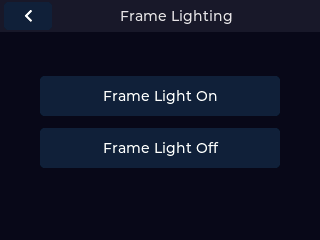 | Frame light control. | Turn frame lighting on or off. | Simple enough today; future brightness control would need more space. |
| Factory Reset | 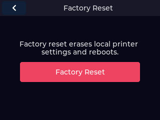 | Local settings reset confirmation. | Tap once, then tap again to erase local printer settings and reboot. | Keep the two-step confirmation; this is intentionally destructive. |
| About Deneb | 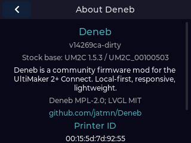 | Version, license, repository, and printer identity reference. | Review Deneb version, stock base, project URL, printer ID, and certifications. | Useful for support screenshots. The host-rendered version includes `-dirty` when local changes are present. |
| Error | 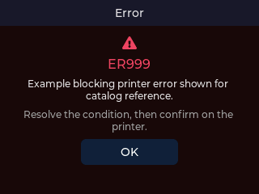 | Blocking ER-code display. | Read error code, description, recommended action, and dismiss with OK. | Host screenshot uses synthetic `ER999` content; real error captures should be added when specific recovery flows are documented. |

## Coverage Gaps To Capture Later

- Active print state with non-zero progress and remaining time.
- USB file browser populated with real print files.
- Material workflow while the printer is busy or actively moving material.
- Network screen with WiFi connected, WiFi disabled, and static Ethernet.
- Digital Factory screenshot refresh for pairing PIN, paired, reconnecting,
  disconnecting, service-error, material-mismatch/cloud-print, and
  print-job-action states. Printer rename has behavior evidence but no distinct
  touchscreen state.
- Real ER-code examples tied to known recovery instructions.
